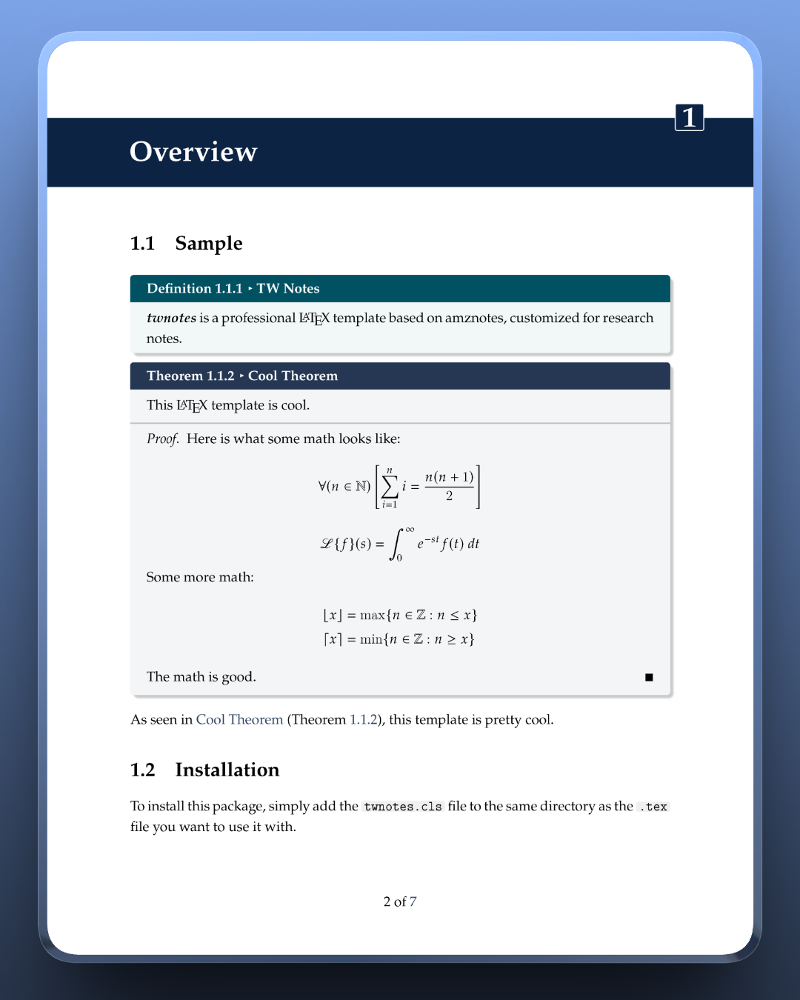

<div align="center">

# TWNotes: Professional LaTeX Research Monograph Template


**A rigorous, aesthetically calibrated LaTeX template designed for researchers and technical writers.**

[Documentation (English)](#documentation) | [中文说明文档](#中文说明文档)

</div>

---

## <a name="documentation"></a> 1. Design Philosophy

**TWNotes** is a comprehensive refactor of the [amznotes](https://github.com/alexmingzhang/amznotes) system. While retaining the modular core, the visual presentation has been overhauled to align with the publication standards of top-tier venues like **CVPR, NeurIPS, and ICCV**.

The design language prioritizes **information density** and **long-form readability**:
* **Typography:** Replaced the default Computer Modern with `newpxtext` and `newpxmath` (Palatino-based), offering a heavier weight that is superior for on-screen reading.
* **Color Theory:** Abandoned high-saturation defaults in favor of a "Dark Academia" palette—Oxford Blue, Deep Teal, and Slate Blue—reducing eye strain during extended coding/writing sessions.
* **Code Aesthetics:** Integrated a custom `minted` configuration with rounded, grayscale inline backgrounds, mimicking the rendering style of modern documentation tools (e.g., Notion, Vercel).

## 2. Visual Preview

<div align="center">
  
  &nbsp;&nbsp;
  
  <br/>
  <p><i>Left: "The Tensor Manifold" (Generative TikZ Cover) &nbsp;&bull;&nbsp; Right: Theorem & Definition Environments</i></p>
</div>

## 3. Key Features

### 🎨 The Academic Color Palette
The template uses a custom defined color spectrum accessible via variables:
* **Oxford Blue** (`twchaptercolor`): Headers, Titles, Chapter decorations.
* **Deep Teal** (`twdfnboxcolor`): Definitions, URLs.
* **Slate Blue** (`twthmboxcolor`): Theorems, Proofs, Links.
* **Antique Bronze** (`twexboxcolor`): Examples.
* **Charcoal** (`twcodeboxcolor`): Code blocks (w/ syntax highlighting).

### ⚡ Technical Stack
* **Generative Cover**: The cover art is not a static image but rendered dynamically using `TikZ` with randomized geometric logic.
* **Modular Architecture**: Features are toggleable via build options (e.g., enable `math` for theorem environments, `code` for Python/Pygments integration).
* **Refined Header/Footer**: Clean, non-intrusive running headers using `fancyhdr`.

## 4. Quick Start

### Prerequisites
* **TeX Distribution**: TeX Live (recommended) or MacTeX.
* **Python Environment**: Required for `minted` syntax highlighting.
    ```bash
    pip install pygments
    ```

### Installation
1.  Clone this repository or download `twnotes.cls`.
2.  Place the `.cls` file in your project root.
3.  **Compile with Shell Escape** (Crucial for code highlighting):
    ```bash
    xelatex -shell-escape main.tex
    ```

### Usage
Initialize the document class with your desired modules:

```latex
% Enable Math environments and Code highlighting
\documentclass[math,code]{twnotes}

% For faster draft compilation (disables fancy headers/decorations)
% \documentclass[math,code,fastcompile]{twnotes}

\title{Computer Vision Notes}
\institution{School of Artificial Intelligence}
\author{Your Name}

\begin{document}
    \maketitle
    \chapter{Introduction}
    ...
\end{document}
```

## 5. Environment Reference

| Environment | Context | LaTeX Syntax | Visual Style |
| :--- | :--- | :--- | :--- |
| **Definition** | Axioms, terms | `\begin{dfnbox}{Title}{label}` |  Deep Teal |
| **Theorem** | Math proofs | `\begin{thmbox}{Title}{label}` |  Slate Blue |
| **Example** | Use cases | `\begin{exbox}{Title}{label}` |  Antique Bronze |
| **Code** | Snippets | `\begin{codebox}{Title}{label}` |  Charcoal |
| **Technique** | Tricks, tips | `\begin{tecbox}{Title}{label}` |  Burnt Sienna |

---

## <a name="中文说明文档"></a> 1. 设计哲学 (Design Philosophy)

**TWNotes** 是对 [amznotes](https://github.com/alexmingzhang/amznotes) 的一次深度重构。在保留其模块化核心的基础上，我们彻底重写了视觉呈现层，使其符合 **CVPR、NeurIPS** 等顶级计算机视觉会议的审美标准。

我们的设计语言强调 **高信息密度** 与 **长文阅读的舒适性**：
* **排版微调：** 摒弃了默认的 Computer Modern 字体，转而采用 `newpxtext` 和 `newpxmath` (Palatino 风格)。这种字体字重略大，衬线细节更丰富，在屏幕阅读时比默认字体具有更好的抗锯齿表现。
* **色彩理论：** 放弃了高饱和度的默认色板，采用了一套“学术暗色系”配色——以牛津蓝 (Oxford Blue)、深青色 (Deep Teal) 和板岩蓝 (Slate Blue) 为主。这不仅提升了专业感，还能有效降低长时间编写代码和论文时的视觉疲劳。
* **代码美学：** 集成了深度定制的 `minted` 配置。特别是对行内代码 (`inline code`) 进行了圆角灰底处理，模仿了 Notion 或 Vercel 文档的现代渲染风格。

## 2. 视觉预览

<div align="center">
  
  &nbsp;&nbsp;
  
  <br/>
  <p><i>左图："The Tensor Manifold" (基于 TikZ 的生成式封面) &nbsp;&bull;&nbsp; 右图：定理与定义环境排版</i></p>
</div>

## 3. 核心特性

### 🎨 学术级配色方案
本模板定义了一套语义化的颜色变量，贯穿整个文档：
* **Oxford Blue** (`twchaptercolor`): 用于页眉、标题、章节装饰页。
* **Deep Teal** (`twdfnboxcolor`): 用于定义 (Definition) 环境、超链接。
* **Slate Blue** (`twthmboxcolor`): 用于定理 (Theorem)、证明、引用。
* **Antique Bronze** (`twexboxcolor`): 用于示例 (Example) 环境。
* **Charcoal** (`twcodeboxcolor`): 用于代码块背景。

### ⚡ 技术栈
* **生成式封面**：封面并非静态图片，而是利用 `TikZ` 通过随机算法动态绘制的几何图形，每次编译的细节均蕴含数学之美。
* **模块化架构**：通过参数按需加载功能（例如：开启 `math` 以加载定理环境，开启 `code` 以集成 Python/Pygments 高亮）。
* **精致的页眉页脚**：使用 `fancyhdr` 实现了不干扰阅读的导航页眉。

## 4. 快速开始

### 环境依赖
* **TeX 发行版**: 推荐 TeX Live 或 MacTeX。
* **Python 环境**: `minted` 宏包依赖 Pygments 进行语法高亮。
    ```bash
    pip install pygments
    ```

### 安装步骤
1.  Clone 本仓库或直接下载 `twnotes.cls`。
2.  将 `.cls` 文件放置于项目根目录。
3.  **启用 Shell Escape 编译** (代码高亮必须)：
    ```bash
    xelatex -shell-escape main.tex
    ```

### 调用方式
在文档类中传入参数以初始化模块：

```latex
% 开启数学环境 (math) 和代码高亮 (code)
\documentclass[math,code]{twnotes}

% 快速编译模式 (关闭章节特效与页眉，用于草稿阶段加速)
% \documentclass[math,code,fastcompile]{twnotes}

\title{Computer Vision Notes}
\institution{School of Artificial Intelligence}
\author{Your Name}

\begin{document}
    \maketitle
    \chapter{Introduction}
    ...
\end{document}
```

## 5. 环境对照表

| 环境名称 | 使用场景 | LaTeX 语法 | 视觉风格 |
| :--- | :--- | :--- | :--- |
| **定义 (Definition)** | 公理、术语定义 | `\begin{dfnbox}{标题}{标签}` |  深青色 |
| **定理 (Theorem)** | 数学证明、推论 | `\begin{thmbox}{标题}{标签}` |  板岩蓝 |
| **示例 (Example)** | 案例分析 | `\begin{exbox}{标题}{标签}` |  古铜色 |
| **代码 (Code)** | 代码片段 | `\begin{codebox}{标题}{标签}` |  炭灰色 |
| **技巧 (Technique)** | 提示、注意事项 | `\begin{tecbox}{标题}{标签}` |  赭石色 |

---

## License

This project is open-sourced under the MIT License.

* Original concept by [Alex M. Zhang (amznotes)](https://github.com/alexmingzhang/amznotes).
* Refactored and redesigned by **TW233**.