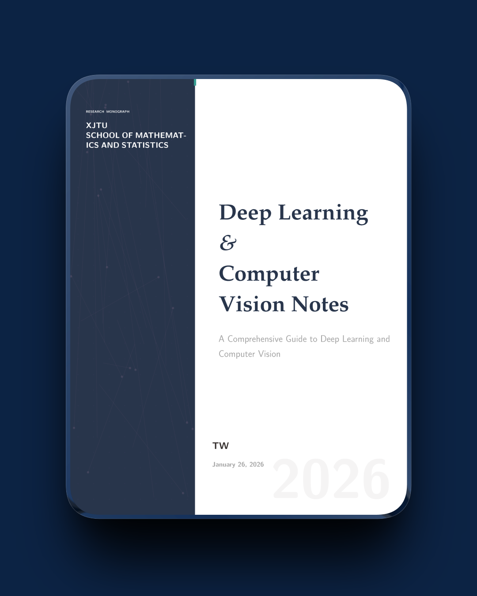
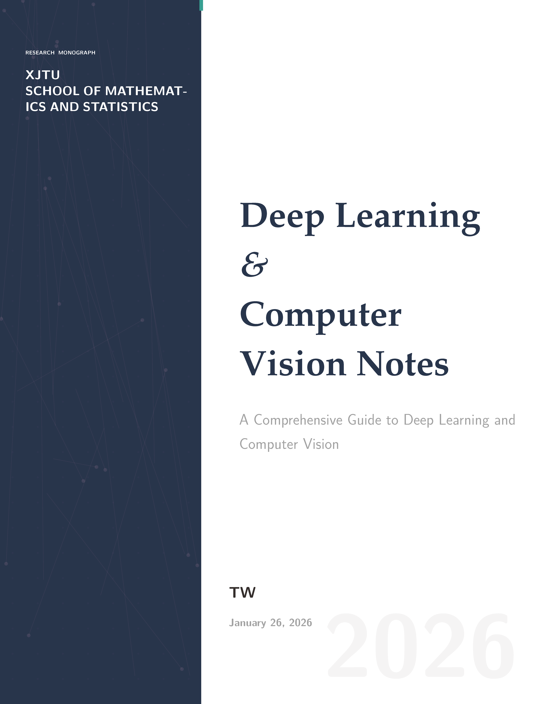
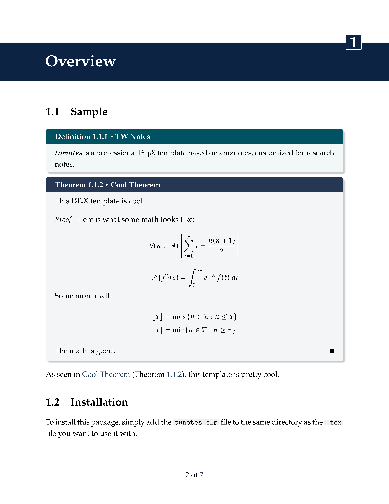

<div align="center">

# TWNotes: Research Monograph LaTeX Template



<br/><br/>

[](https://github.com/TW233/TWNotes-LaTeX-Template-releases)
[](https://tug.org/xetex/)
[](LICENSE)


**A strictly typed, algorithmically generated LaTeX template for researchers.**

[Documentation (English)](#documentation-english) | [中文说明文档](#documentation-chinese)

</div>

<br/>

## <a name="documentation-english"></a> 1. Design Philosophy

**TWNotes** is an engineering-focused refactor of the [amznotes](https://github.com/alexmingzhang/amznotes) system, specifically tuned for long-form technical writing such as research monographs, lecture notes, and PhD theses. It bridges the gap between the chaotic visual noise of standard LaTeX classes and the rigid publication standards of top-tier vision conferences.

### Core Pillars
* **Algorithmic Aesthetics**: The cover art is not a static asset but a procedurally generated vector graphic, ensuring crisp rendering at any resolution.
* **Cognitive Ergonomics**: The color palette is calibrated using the "Dark Academia" spectrum (Oxford Blue / Slate Blue) to minimize eye strain during extended reading sessions on backlit screens.
* **Code-First Architecture**: Syntax highlighting is powered by Python's `Pygments` (via `minted`), featuring a custom `inline-code` renderer that mimics the rounded visual language of modern IDEs.

---

## 2. "The Tensor Manifold" Cover Art

Unlike traditional templates that use static JPG/PNG images, TWNotes features a **Generative Cover System** built entirely in TikZ.

<table border="0">
  <tr>
    <td width="50%">
      
    </td>
    <td width="50%" valign="top">
      <h3>The Algorithm</h3>
      The cover design, dubbed <i>"The Tensor Manifold"</i>, visualizes the high-dimensional latent space of neural networks.
      <br/><br/>
      <ul>
        <li><strong>Stochastic Topology:</strong> The network of lines and nodes (<code>\foreach \i in {1,...,25}</code>) uses randomization (<code>rnd</code>) to generate a unique geometric constellation every time you compile. No two covers are mathematically identical.</li>
        <li><strong>Full-Bleed Rendering:</strong> Utilizes <code>current page.north west</code> anchors to bypass page margins, creating an immersive, edge-to-edge visual field.</li>
        <li><strong>Layered Opacity:</strong> Multiple render passes with varying alpha channels (<code>opacity=0.08</code> to <code>0.15</code>) create depth and texture without requiring external graphics software.</li>
      </ul>
    </td>
  </tr>
</table>

---

## 3. Visual & Technical Specifications

<table border="0">
  <tr>
    <td width="50%">
      
    </td>
    <td width="50%" valign="top">
      <h3>Precision Typesetting Architecture</h3>
      The internal layout engine is engineered to maximize <strong>information hierarchy</strong> and <strong>readability</strong> for technical content.
      <br/><br/>
      <ul>
        <li><strong>Modular Containers:</strong> Content is strictly typed. Theorems (Slate Blue) and Definitions (Deep Teal) are encapsulated in distinct <code>tcolorbox</code> environments, visually separating "derived truths" from "foundational axioms".</li>
        <li><strong>Harmonized Math:</strong> Unlike standard LaTeX, we use <code>newpxmath</code> to ensure that mathematical operators ($\int, \sum$) match the stroke weight and serif style of the Palatino body text, creating a seamless reading flow.</li>
        <li><strong>Semantic Spacing:</strong> Vertical rhythm is managed via <code>parskip</code> and strictly defined header margins, eliminating the dense "wall of text" effect common in default academic templates.</li>
      </ul>
    </td>
  </tr>
</table>

### The Color System
We employ a semantic coloring strategy where every color serves a logical function.

| Semantic Role | Palette Badge (Hex) | Usage Context |
| :--- | :--- | :--- |
| **Primary Theme** |  | Chapter Headers, Title Bars, Cover Background |
| **Definitions** |  | Axioms, Definitions, URL Links |
| **Theorems** |  | Theorems, Lemmas, Proofs, Internal Refs |
| **Examples** |  | Case Studies, Examples |
| **Code Blocks** |  | Code Snippets, Terminal Outputs |
| **Techniques** |  | Tips, Warnings, "Tricks of the Trade" |

### Typography Stack
* **Body Text**: `newpxtext` (Palatino clone). Chosen for its humanist stroke variation which offers superior readability over Computer Modern.
* **Mathematics**: `newpxmath`. Ensures mathematical symbols match the weight and serif style of the body text.
* **Monospace**: `Inconsolata`. A humanist monospaced font optimized for code legibility.

---

## 4. Usage Guide

### Prerequisites
1.  **TeX Distribution**: TeX Live 2023+ (Recommended) or MacTeX.
2.  **Python Environment**: Required for the `minted` package.
    ```bash
    pip install pygments
    ```

### Compilation
⚠️ **CRITICAL**: You must execute the compiler with `-shell-escape` to allow LaTeX to call the Python syntax highlighter.

```bash
# Recommended Engine
xelatex -shell-escape main.tex
```

### Boilerplate Code
```latex
\documentclass[math,code]{twnotes}

% Meta-data for the Cover Generator
\title{Deep Learning Notes}
\subtitle{A Comprehensive Guide to Vision Transformers}
\institution{Institute for Advanced Study}
\author{Your Name}
\date{\today}

\begin{document}
    \maketitle
    
    \chapter{Introduction}
    
    \begin{dfnbox}{Latent Space}{def:latent}
        A manifold $\mathcal{M}$ embedded in $\mathbb{R}^n$ where...
    \end{dfnbox}

    \begin{codebox}{PyTorch Example}{code:torch}
    \begin{twcode}{python}
    import torch.nn as nn
    layer = nn.Linear(128, 64)
    \end{twcode}
    \end{codebox}
\end{document}
```

---

## 5. Advanced Configuration

### Package Options
Load the class with specific flags to toggle functionality:

| Option | Description | Performance Impact |
| :--- | :--- | :--- |
| `math` | Enables `thmbox`, `lembox`, and `\laplace` macros. | Low |
| `code` | Enables `minted` integration. Requires Python. | Medium |
| `fastcompile` | **Debug Mode**. Disables the TikZ cover, fancy headers, and chapter decorations. Use this when writing content to speed up compilation 10x. | **High Speed** |

### Directory Structure
For larger monographs, we recommend the following modular structure:

```text
root/
├── twnotes.cls          # Core Logic (Do not edit)
├── main.tex             # Entry Point
├── images/              # Static Assets (PNG/PDF)
├── code/                # External scripts for \twinputcode
└── sections/            # Content Modules
    ├── 01_intro.tex
    ├── 02_cnn.tex
    └── 03_transformers.tex
```

<details>
<summary><strong>🛠 Troubleshooting (Click to Expand)</strong></summary>

<br>

**1. Error: `Package minted Error: You must invoke LaTeX with -shell-escape`**
* **Cause**: The compiler is blocked from running Python scripts.
* **Fix**: Update your build command. In VS Code (LaTeX Workshop), go to `Settings > Tools > latex-workshop.latex.tools` and add `"-shell-escape"` to the arguments list.

**2. Error: `Font not found`**
* **Cause**: Your TeX distribution is missing the Palatino fonts.
* **Fix**: Run `tlmgr install newpx` (TeX Live) or use the MikTeX Console to install `newpxtext` and `newpxmath`.

**3. Cover Art is missing?**
* **Cause**: You might have enabled the `fastcompile` option.
* **Fix**: Remove `fastcompile` from `\documentclass[...]` for the final build.

</details>

<br/><br/>

---

## <a name="documentation-chinese"></a> 1. 设计哲学 (Design Philosophy)

**TWNotes** 是针对 `amznotes` 系统的一次工程化重构，专为长篇学术写作（如研究专著、讲义、博士论文）量身定制。它弥合了标准 LaTeX 模板的视觉混乱与顶级视觉会议（如 CVPR/ICCV）严格出版标准之间的差距。

### 核心理念
* **算法美学 (Algorithmic Aesthetics)**：封面并非静态图片，而是完全由代码生成的矢量图形。无论放大多少倍，边缘依然锐利。
* **认知工学 (Cognitive Ergonomics)**：基于“暗学术 (Dark Academia)”风格校准的色板（牛津蓝/板岩蓝），能有效减少在背光屏幕上长时间阅读产生的视觉疲劳。
* **代码优先 (Code-First)**：语法高亮引擎由 Python 的 `Pygments` (通过 `minted`) 驱动，并配备了模仿现代 IDE 风格的圆角行内代码渲染器。

---

## 2. "The Tensor Manifold" 生成式封面

与使用静态图片的传统模板不同，TWNotes 内置了一个基于 **TikZ** 的生成式封面系统。

<table border="0">
  <tr>
    <td width="50%">
      
    </td>
    <td width="50%" valign="top">
      <h3>生成算法解析</h3>
      这个被称为 <i>"The Tensor Manifold" (张量流形)</i> 的设计，旨在可视化神经网络的高维潜在空间。
      <br/><br/>
      <ul>
        <li><strong>随机拓扑 (Stochastic Topology)：</strong> 线条与节点网络 (<code>\foreach</code>) 利用随机函数 (<code>rnd</code>) 生成。这意味着你每次编译文档，都会诞生一个数学上独一无二的几何星系。</li>
        <li><strong>Full-Bleed 渲染 (Full-Bleed Rendering)：</strong> 利用 <code>current page</code> 锚点突破页边距限制，创造出沉浸式的无边框视觉体验。</li>
        <li><strong>层叠透明度 (Layered Opacity)：</strong> 通过多重渲染通道叠加不同的 Alpha 通道 (0.08 - 0.15)，在不依赖外部绘图软件的情况下构建出深邃的空间感。</li>
      </ul>
    </td>
  </tr>
</table>

---

## 3. 视觉与技术规格

<table border="0">
  <tr>
    <td width="50%">
      
    </td>
    <td width="50%" valign="top">
      <h3>精密排版架构 (Typesetting Architecture)</h3>
      内页布局引擎专为技术内容设计，旨在最大化<strong>信息层级</strong>的清晰度与<strong>阅读体验</strong>。
      <br/><br/>
      <ul>
        <li><strong>模块化容器 (Modular Containers)：</strong> 内容被严格分类。定理（板岩蓝）和定义（深青色）被封装在不同的 <code>tcolorbox</code> 环境中，从视觉上将“推导出的真理”与“基础公理”彻底区分开来。</li>
        <li><strong>数学调和 (Harmonized Math)：</strong> 与标准 LaTeX 不同，我们使用 <code>newpxmath</code> 确保数学运算符 ($\int, \sum$) 的字重和衬线风格与 Palatino 正文完美匹配，创造流畅的阅读流。</li>
        <li><strong>语义化间距 (Semantic Spacing)：</strong> 通过 <code>parskip</code> 和严格定义的标题边距管理垂直节奏，消除了默认学术模板中常见的“文字墙”效应。</li>
      </ul>
    </td>
  </tr>
</table>

### 语义化配色系统
我们采用“语义化着色”策略，每一种颜色都对应特定的逻辑功能。

| 语义功能 | 色板标识 (Hex) | 使用场景 |
| :--- | :--- | :--- |
| **主视觉** |  | 章节页眉、标题栏、封面背景 |
| **定义** |  | 公理、定义、URL 超链接 |
| **定理** |  | 定理、引理、证明、内部引用 |
| **示例** |  | 案例分析、具体示例 |
| **代码** |  | 代码片段、终端输出 |
| **技巧** |  | 提示、警告、避坑指南 |

### 字体技术栈
* **正文**: `newpxtext` (Palatino 变体)。相比于 Computer Modern，它拥有更强的人文主义笔触和更粗的字重，极大提升了屏幕阅读体验。
* **数学公式**: `newpxmath`. 确保数学符号的字重与衬线风格与正文完美匹配。
* **等宽字体**: `Inconsolata`. 专为代码可读性优化的人文主义等宽字体。

---

## 4. 使用指南

### 环境要求
1.  **TeX 发行版**: 推荐 TeX Live 2023+ 或 MacTeX。
2.  **Python 环境**: `minted` 宏包依赖此环境。
    ```bash
    pip install pygments
    ```

### 编译指令
⚠️ **重要**: 必须使用 `-shell-escape` 参数启动编译器，以允许 LaTeX 调用外部 Python 脚本进行语法高亮。

```bash
# 推荐使用 XeLaTeX 引擎
xelatex -shell-escape main.tex
```

### 基础模板
```latex
\documentclass[math,code]{twnotes}

% 封面生成器元数据
\title{Deep Learning Notes}
\subtitle{A Comprehensive Guide to Vision Transformers}
\institution{Institute for Advanced Study}
\author{Your Name}
\date{\today}

\begin{document}
    \maketitle
    
    \chapter{Introduction}
    
    \begin{dfnbox}{Latent Space}{def:latent}
        A manifold $\mathcal{M}$ embedded in $\mathbb{R}^n$ where...
    \end{dfnbox}
\end{document}
```

---

## 5. 高级配置与工程化

### 编译选项 (Options)
通过加载文档类时的参数来控制功能模块：

| 选项 | 描述 | 性能影响 |
| :--- | :--- | :--- |
| `math` | 启用 `thmbox` (定理), `lembox` (引理) 及数学宏。 | 低 |
| `code` | 启用 `minted` 代码高亮集成。需要 Python 环境。 | 中 |
| `fastcompile` | **调试模式**。关闭 TikZ 封面、花式页眉和章节特效。建议在写作内容阶段开启，可提升 10 倍编译速度。 | **极速** |

### 推荐项目结构
对于大型专著，我们推荐以下模块化结构：

```text
root/
├── twnotes.cls          # 核心类文件 (核心逻辑，勿动)
├── main.tex             # 入口文件
├── images/              # 静态资源目录 (PNG/PDF)
├── code/                # 用于 \twinputcode 引入的外部脚本
└── sections/            # 内容分块
    ├── 01_intro.tex
    ├── 02_cnn.tex
    └── 03_transformers.tex
```

<details>
<summary><strong>🛠 常见故障排除 (点击展开)</strong></summary>

<br>

**1. 报错: `Package minted Error: You must invoke LaTeX with -shell-escape`**
* **原因**: 编译器没有权限运行 Python 脚本。
* **解决**: 修改编译命令。如果你使用 VS Code (LaTeX Workshop)，请进入 `Settings > Tools > latex-workshop.latex.tools` 并在参数列表中添加 `"-shell-escape"`。

**2. 报错: `Font not found`**
* **原因**: 你的 TeX 发行版缺少 Palatino 字体包。
* **解决**: 运行 `tlmgr install newpx` (TeX Live) 或使用 MikTeX Console 安装 `newpxtext` 和 `newpxmath`。

**3. 封面消失了？**
* **原因**: 你可能开启了 `fastcompile` 选项。
* **解决**: 在最终出稿时，从 `\documentclass[...]` 中移除 `fastcompile` 即可。

</details>

<br/><br/>

---

## License

This project is open-sourced under the MIT License.

* Original concept by [Alex M. Zhang (amznotes)](https://github.com/alexmingzhang/amznotes).
* Refactored and Redesigned by **TW233**.